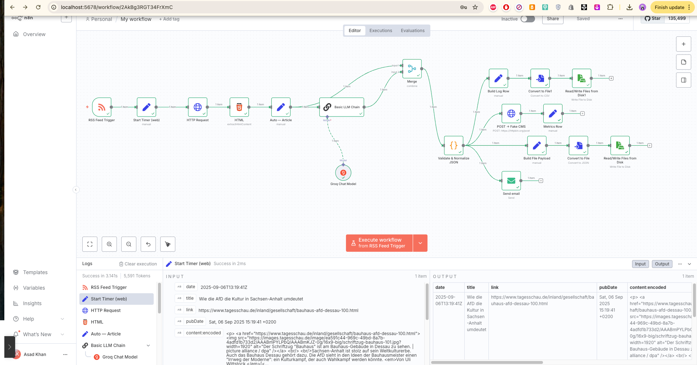
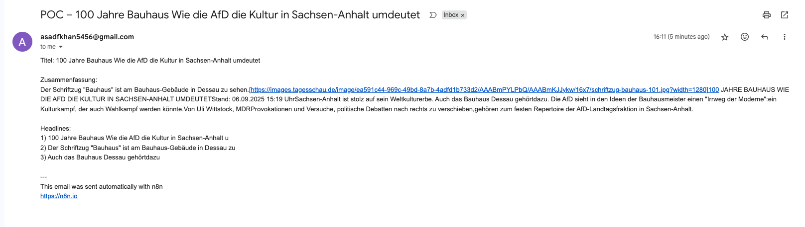

# Newsroom AI Agent – AIKHAN

*A compact automation that fetches fresh articles, generates a 3-sentence German summary and 3 SEO-friendly headlines, validates JSON, posts to a mock CMS, emails the editor, and logs metrics — all in n8n.*

---

#### Overview
This agent watches RSS for new posts, loads the article page, extracts title/body, asks an LLM for a **3-sentence DE summary + 3 headlines**, validates/repairs the JSON, and then ships it to multiple outputs (file, API, email, metrics).

#### Problem
Editors lose time on repetitive tasks: summarizing copy, writing headlines, pasting into systems, and maintaining logs — slow and error-prone.

#### Goal
Automate **ingest → summarize → headline → validate → deliver → log**, so humans focus on judgment and quality.

#### What It Does
- Detects new items via RSS  
- Fetches the article HTML and extracts **title** + **body**  
- Generates `{ "summary": "...", "headlines": ["...", "...", "..."] }`  
- Validates JSON and applies a safe fallback (builds a 3-sentence summary from the body)  
- Outputs in parallel: **JSON file**, **HTTP POST** (mock CMS), **email to editor**, **CSV logs/metrics**

---

#### Architecture (n8n High-Level)

RSS Trigger → Start Timer → HTTP Request → HTML (extract)
→ Auto—Article (Set: title, body)
→ LLM (chat) → Merge (Combine by Position)
→ Validate & Normalize JSON
├─ Convert to File (JSON) → Write File (archive)
├─ POST → Fake CMS (httpbin)
├─ Send Email (SMTP)
└─ Build Metrics Row → Convert to CSV → Write File (append)

#### Workflow Diagram
  
*Fig. 1 – n8n workflow overview*

#### Sample Email Output
  
*Fig. 2 – Example email with summary & headlines*

---

#### Tech Stack
- **n8n** (RSS, HTTP, HTML extract, Merge, Function, Convert to File, Read/Write Files, Send Email)  
- **LLM**: Groq chat model (low latency)  
- **Mock CMS**: `httpbin.org/post` (echo service)  
- **SMTP** for email (e.g., Gmail App Password on self-hosted n8n)

---

#### Setup
1. **Import** `workflow/newsroom_agent.json` into your n8n instance.  
2. **Credentials**
   - Groq (Chat) API key
   - SMTP (Send Email)  
3. **Node Options**
   - HTTP Request → include response headers & status (for logging)  
   - HTML → CSS selectors:  
     - Title: `h1` (fallback: `meta[property="og:title"]`)  
     - Body: `article, main article, main, div[itemprop="articleBody"]`  
   - Read/Write Files: set paths under a mounted folder (self-hosted n8n)  
4. **Images**: place `images/newsroom-workflow.png` and `images/newsroom-email.png` in the repo paths shown above.  
5. **Activate** the workflow if using **RSS Trigger** (new items only).

---

#### Usage
- **Automatic**: RSS triggers on new items and runs end-to-end.  
- **Manual test**: execute from n8n; you can also keep a manual “Input — Article” node for local tests.

---

#### Outputs
- **File**: `summary_YYYYMMDD_HHmmss.json` (validated)  
- **API**: POST to mock CMS (echo)  
- **Email**: title + summary + 3 headlines  
- **Metrics**: CSV row (timestamp, title, duration, POST status, summary length, H1–H3)

---

#### Configuration Notes
- **Model**: low temperature (~0.2–0.3) for consistent summaries & headlines  
- **Validation**: Function node enforces `{summary, headlines[3]}` and trims headlines ≤ 60 chars  
- **Selectors**: adjust per site if body extraction is empty  
- **Files**: when self-hosting with Docker, map a volume for the output folder

---

#### Roadmap
- Multiple feeds + per-site selectors  
- De-duplication (“already processed?”)  
- Human-in-the-loop approvals (email/Slack)  
- Real CMS integration (replace httpbin)  
- Quality rules: banned words, tone checks, A/B headlines  
- Mini dashboard (counts, latency, error rate)

---

#### Repository Structure
├─ images/
│ ├─ newsroom-workflow.png
│ └─ newsroom-email.png
├─ workflow/
│ └─ newsroom_agent.json
└─ README.md

---

#### License
MIT

#### Author
**Asad Faiyyaz Khan**

